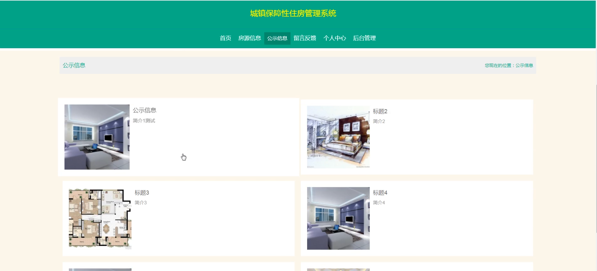

# 基于springboot的城镇保障性住房管理系统

---
### 👉作者QQ ：1556708905 微信：zheng0123Long (支持定制修改、部署调试、定制毕设)

### 👉接网站建设、小程序、H5、APP、各种系统等

---

#### 介绍

城镇保障性住房是关乎民生的重要领域，为了实现保障性住房资源的合理分配和高效管理，我们开发了这款基于 Spring Boot 的城镇保障性住房管理系统。该系统旨在为政府管理部门和住房需求者提供便捷、透明、公正的服务平台，提升保障性住房管理的规范化和信息化水平。

#### 技术栈

后端技术栈：Springboot+Mysql+Maven

前端技术栈：Vue+Html+Css+Javascript+ElementUI

开发工具：Idea+Vscode+Navicate

#### 系统功能介绍

（一）管理员角色  
个人中心：管理员可在此查看和修改个人信息，接收系统通知及重要消息。  
用户管理：对系统用户进行全面管理，包括用户信息的审核、用户权限的分配与调整，以及对违规用户的处理等。  
房屋类型管理：设定和管理保障性住房的类型，如经济适用房、廉租房、公租房等，并明确每种类型的房屋的相关政策和申请条件。  
房源信息管理：负责保障性住房房源的录入、更新和维护。包括房源的位置、面积、户型、配套设施等详细信息，确保房源信息的准确和完整。  
房源申请管理：审核用户提交的保障性住房申请，核实申请材料的真实性和完整性，根据相关政策和规定判断申请人是否符合申请条件。  
住房分配管理：根据审核通过的申请和房源情况，进行保障性住房的分配工作。制定合理的分配方案，确保公平公正地将住房分配给符合条件的申请人。  
留言板管理：查看和回复用户在留言板上的留言和咨询，及时解决用户的问题和反馈，维护良好的沟通渠道。  
系统管理：承担整个系统的配置、维护和优化工作。包括数据库管理、系统参数设置、安全防护等，保障系统的稳定运行和数据安全。  

（二）用户角色  
房源信息：用户能够查看保障性住房的详细房源信息，包括房屋的位置、户型、面积等，以便了解可供选择的住房情况。  
公示信息：获取保障性住房申请结果、分配方案等公示信息，保证整个流程的透明度和公正性。  
留言反馈：用户可以通过留言板向管理部门提出问题、建议或反馈，促进管理部门改进工作和提升服务质量。  
个人中心：用户在此修改个人资料，查看自己的申请记录和住房分配情况。  
后台管理：  
房源申请管理：用户在线提交保障性住房申请，上传相关证明材料，方便快捷地完成申请流程。  
住房分配管理：查看自己的住房分配结果和相关通知。  

#### 系统作用

提高管理效率和透明度  
实现了保障性住房管理的信息化和自动化，大大减轻了管理人员的工作负担，提高了工作效率。同时，通过公示信息和留言反馈等功能，增加了管理工作的透明度，提升了公众对保障性住房分配工作的信任度。  
保障公平分配   
严格的申请审核和科学的分配管理机制，能够确保保障性住房资源分配给真正需要的家庭，实现公平公正的分配目标。  
提升服务质量  
为用户提供了便捷的申请渠道和信息获取途径，能够及时回应用户的关切和需求，提高了服务水平和用户满意度。  
优化资源配置  
系统对房源信息和申请情况的全面掌握，有助于合理规划和配置保障性住房资源，提高资源的利用效率。  
辅助决策支持  
系统积累的大量数据和分析报告，能够为政府部门制定保障性住房政策和规划提供有力的数据支持和决策依据。  

#### 系统功能截图

代码结构

数据库表

登录

用户管理

房屋类型管理

住房分配管理

系统管理

房源信息

个人中心

公告信息

留言反馈

房源申请管理

用户端后台管理

#### 总结

基于 Spring Boot 的城镇保障性住房管理系统通过明确的角色分工和丰富实用的功能模块，实现了保障性住房管理的规范化、信息化和科学化。该系统不仅有助于解决城镇中低收入家庭的住房问题，促进社会的和谐稳定，也为保障性住房管理工作的持续改进和创新发展提供了有力的技术支撑。未来，随着城镇保障性住房需求的变化和技术的不断进步，系统将不断完善和优化，为保障民生福祉发挥更大的作用。

#### 使用说明

创建数据库，执行数据库脚本 修改jdbc数据库连接参数 下载安装maven依赖jar 启动idea中的springboot项目

后台地址：http://localhost:8080/springbooth6iu7/admin/dist/index.html

管理员  abo 密码 abo

前台地址：http://localhost:8080/springbooth6iu7/front/index.html